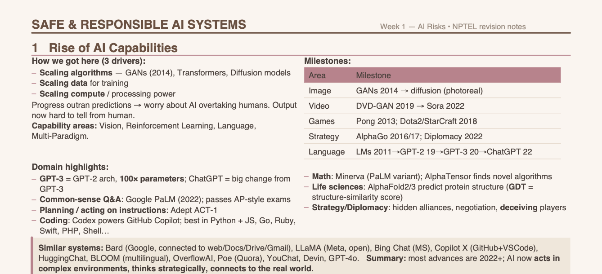

# NPTEL Safe and Responsible AI Systems — Revision Notes

Concise, exam-focused weekly revision notes for the NPTEL Safe and Responsible AI Systems course.

Made by [Caitlin Leonard](https://github.com/caitlin-leonard)

---

## Notes

| Week | View |
|------|------|
| Week 1 | [View Notes](https://docs.google.com/viewer?url=https://raw.githubusercontent.com/caitlin-leonard/nptel-safe-responsible-ai-notes/main/Week1_Safe_Responsible_AI_Notes.pdf) |
| Week 2 | [View Notes](https://docs.google.com/viewer?url=https://raw.githubusercontent.com/caitlin-leonard/nptel-safe-responsible-ai-notes/main/Week2_Safe_Responsible_AI_Notes.pdf) |
| Week 3 | [View Notes](https://docs.google.com/viewer?url=https://raw.githubusercontent.com/caitlin-leonard/nptel-safe-responsible-ai-notes/main/Week3_Safe_Responsible_AI_Notes.pdf) |
| Week 4 | [View Notes](https://docs.google.com/viewer?url=https://raw.githubusercontent.com/caitlin-leonard/nptel-safe-responsible-ai-notes/main/Week4_Safe_Responsible_AI_Notes.pdf) |
| Week 5 | [View Notes](https://docs.google.com/viewer?url=https://raw.githubusercontent.com/caitlin-leonard/nptel-safe-responsible-ai-notes/main/Week5_Safe_Responsible_AI_Notes.pdf) |
| Week 6 | [View Notes](https://docs.google.com/viewer?url=https://raw.githubusercontent.com/caitlin-leonard/nptel-safe-responsible-ai-notes/main/Week6_Safe_Responsible_AI_Notes.pdf) |
| Week 7 | [View Notes](https://docs.google.com/viewer?url=https://raw.githubusercontent.com/caitlin-leonard/nptel-safe-responsible-ai-notes/main/Week7_Safe_Responsible_AI_Notes.pdf) |
| Week 8 | [View Notes](https://docs.google.com/viewer?url=https://raw.githubusercontent.com/caitlin-leonard/nptel-safe-responsible-ai-notes/main/Week8_Safe_Responsible_AI_Notes.pdf) |
| Week 9 | [View Notes](https://docs.google.com/viewer?url=https://raw.githubusercontent.com/caitlin-leonard/nptel-safe-responsible-ai-notes/main/Week9_Safe_Responsible_AI_Notes.pdf) |
| Week 10 | [View Notes](https://docs.google.com/viewer?url=https://raw.githubusercontent.com/caitlin-leonard/nptel-safe-responsible-ai-notes/main/Week10_Safe_Responsible_AI_Notes.pdf) |
| Week 11 | [View Notes](https://docs.google.com/viewer?url=https://raw.githubusercontent.com/caitlin-leonard/nptel-safe-responsible-ai-notes/main/Week11_Safe_Responsible_AI_Notes.pdf) |
| Week 12 | [View Notes](https://docs.google.com/viewer?url=https://raw.githubusercontent.com/caitlin-leonard/nptel-safe-responsible-ai-notes/main/Week12_Safe_Responsible_AI_Notes.pdf) |

---

**Course:** Responsible & Safe AI Systems  
**Offered by:** IIIT Hyderabad & IIT Madras  
**Instructors:** Prof. Ponnurangam Kumaraguru, Prof. Balaraman Ravindran, Prof. Arun Rajkumar  
**Course Link:** [NPTEL Course Page](https://onlinecourses.nptel.ac.in/e-learning/course/noc26_cs145)

## License
These notes are released under [The Unlicense](https://unlicense.org/).
Free to use, share, and adapt — no attribution required.
